# LONFRO 页面 UI 流程图

```mermaid
flowchart LR
    traffic([TikTok / 海外广告]) ==> home[Home 首页]

    subgraph discovery ["产品发现"]
        direction TB
        catalog[All Products 产品列表]
        seriesPages[5 个系列分类页]
        searchFilters[搜索与筛选]
        productCard[产品卡片]
        catalog --> searchFilters --> productCard
        seriesPages --> productCard
    end

    subgraph companyPages ["品牌与制造信息"]
        direction TB
        aboutPage[About Us]
        oemPage[OEM / ODM]
        contactPage[Contact 页面]
    end

    subgraph productDecision ["产品决策"]
        direction TB
        detailPage[Product Detail 产品详情]
        quantityInput[填写采购数量]
        quantityTier{采购数量区间}
        priceUnder[显示 500 件以内价格]
        contactPrice[显示 Contact for Price]
        priceOver[显示 1000 件以上价格]
        detailPage --> quantityInput --> quantityTier
        quantityTier -->|"1-500 件"| priceUnder
        quantityTier -->|"501-999 件"| contactPrice
        quantityTier -->|"1000 件以上"| priceOver
    end

    subgraph conversion ["询价转化"]
        direction TB
        contactChoice{选择联系渠道}
        whatsapp[Chat on WhatsApp]
        prefilledMessage[自动带入型号与数量]
        quoteButton[Request a Quote]
        quoteForm[询价表单]
        contactChoice --> whatsapp --> prefilledMessage
        contactChoice --> quoteButton --> quoteForm
    end

    subgraph followUp ["销售跟进"]
        direction TB
        privateLead[进入私域线索]
        formalQuote[发送正式报价]
        privateLead --> formalQuote
    end

    home --> catalog
    home --> seriesPages
    home --> aboutPage
    home --> oemPage
    home --> contactPage
    productCard ==> detailPage
    priceUnder --> contactChoice
    contactPrice --> contactChoice
    priceOver --> contactChoice
    oemPage --> quoteButton
    contactPage --> quoteForm
    prefilledMessage ==> privateLead
    quoteForm ==> privateLead

    footer[Footer 页脚] -.-> legalPages[Privacy / Terms / Cookie Notice]
    home -.-> footer

    style discovery fill:#C2E5FF,stroke:#3DADFF
    style companyPages fill:#D9D9D9,stroke:#B3B3B3
    style productDecision fill:#FFECBD,stroke:#FFC943
    style conversion fill:#C6FAF6,stroke:#5AD8CC
    style followUp fill:#CDF4D3,stroke:#66D575
    style traffic fill:#C2E5FF,stroke:#3DADFF
    style home fill:#C2E5FF,stroke:#3DADFF
    style privateLead fill:#CDF4D3,stroke:#66D575
    style formalQuote fill:#CDF4D3,stroke:#66D575
```

## 页面层级

- 一级入口：首页、全部产品、五个系列、About、OEM / ODM、Contact
- 核心浏览：产品列表、搜索筛选、产品卡片、产品详情
- 核心转化：WhatsApp 和询价表单
- 价格逻辑：1-500 件、501-999 件、1000 件以上
- 合规页面：Privacy Policy、Terms of Use、Cookie Notice
